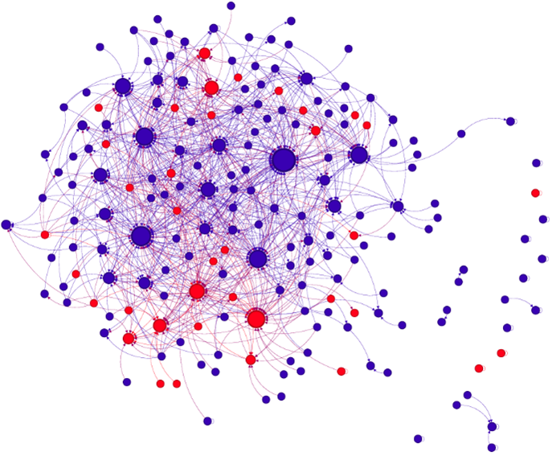

# Enhancing Conspiracy Detection in Hebrew Tweets Using Retweet Networks and Large Language Models

This project explores enhanced conspiracy theory detection in Hebrew-language tweets using a combination of **textual analysis via large language models (LLMs)** and **retweet network-based features**. The work focuses on identifying hidden conspiratorial content—particularly in the context of COVID-19 and vaccine skepticism—by combining **graph structure insights** with **Chain-of-Thought (CoT) prompting** for better reasoning.

---

## 📌 Project Goals

- Detect conspiratorial tweets in Hebrew using LLMs.
- Integrate **social network context** (retweets, user connections) into model inputs.
- Leverage **Chain-of-Thought reasoning** to improve model interpretability and accuracy.
- Evaluate performance across different structured prompting strategies.

---

## 🧠 Methodology

1. **Dataset**  
   - 4,000 Hebrew tweets categorized into:  
     - `Unrelated`  
     - `COVID-related`  
     - `Vaccine Opposition`  
   - Annotated with 5 binary questions assessing conspiracy traits.

2. **Retweet Graph Construction**  
   - Built a **retweet network** of 195 users and 739 edges.  
   - Extracted key **network features**:
     - In-degree / Out-degree
     - Closeness / Betweenness centrality
     - Community size
     - Number of conspiratorial neighbors

3. **Prompting Strategies**  
   - 7 prompt types tested:
     - Minimal (text only)
     - Degree-based
     - Centrality-based
     - Community-based
     - Full-Feature
     - Minimal + CoT
     - Full-Feature + CoT
## 🕸️ Retweet Network Visualization

Add **network-based context** to each tweet using a graph of user interactions (retweets).  
Red = conspiratorial users, Blue = non-conspiratorial, Gray = unlabeled.

## 🤖 Language Models

We tested two models:

- **DictaLM-2.0** – Hebrew-specific LLM, but struggled with task consistency.
- **Gemini** – Multilingual LLM with better reasoning and accuracy.

Gemini with **Chain-of-Thought prompting** achieved the best results.

## 📊 Results

| Prompt Type                         | Accuracy (%) | Precision (%) | Recall (%) | F1 Score (%) |
|------------------------------------|--------------|----------------|-------------|----------------|
| Minimal Prompt                     | 59.29        | 41.11          | 94.39       | 57.28          |
| Degree-Based Prompt                | 62.97        | 43.33          | 95.29       | 59.57          |
| Centrality-Based Prompt            | 69.36        | 47.68          | 81.05       | 60.04          |
| Community + Neighbors-Based Prompt| 58.54        | 40.76          | 93.37       | 56.74          |
| Full-Feature Prompt                | 59.52        | 41.69          | 91.96       | 57.37          |
| Minimal Prompt + CoT               | 57.85        | 40.58          | 94.69       | 56.81          |
| **Full-Feature Prompt + CoT**      | **76.04**    | **58.12**      | **68.34**   | **62.82**      |

> 🧠 **Chain-of-Thought reasoning** with all network features led to the best performance — indicating that structured step-by-step processing helps LLMs utilize social context effectively.

## 📈 Visual Results
---

### 🔹 Performance Metrics  

### 🔹 Confusion Matrix Breakdown  

## 💬 CoT Prompt Examples

Illustrations of how the LLM used structured reasoning and social features to classify tweets:

### 🟥 False Positives (Predicted Conspiracy, but wasn't)
- 

### 🟦 False Negatives (Missed conspiracy)
- 

These examples highlight how the model balanced between textual ambiguity and graph-derived context.
